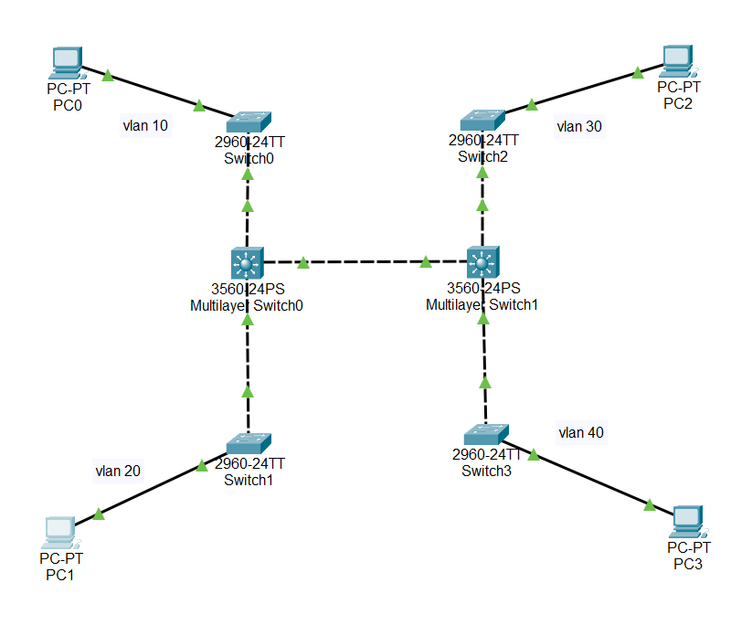

# CDP Protocol Network Project

## 📌 Project Overview
This project demonstrates the **Cisco Discovery Protocol (CDP)** in a multi-switch and multi-VLAN network using two Multilayer Switches (MLS).  
The network is designed to allow **device discovery**, **VLAN segmentation**, and **inter-VLAN routing**.

---

## 🖥️ Network Topology


*(The detailed topology image is attached with the project)*

- **MLS0 (Core-1)** connected to Switch0 & Switch1
- **MLS1 (Core-2)** connected to Switch2 & Switch3
- Each VLAN has a dedicated host to test inter-VLAN communication
- CDP protocol is used to discover connected devices

---

## 🔹 VLAN Configuration

| VLAN | Name       | IP on MLS        |
|------|-----------|-----------------|
| 10   | VLAN0010  | 192.168.10.1    |
| 20   | VLAN0020  | 192.168.20.1    |
| 30   | VLAN0030  | 192.168.30.1    |
| 40   | VLAN0040  | 192.168.40.1    |

---

## 🔹 Key Commands & Outputs

### 1️⃣ Show CDP Neighbors
```
Device ID    Local Intrfce   Holdtme    Capability   Platform    Port ID
Switch       Fas 0/7         159        S           2960        Fas 0/1
me           Fas 0/3         159                    3560        Fas 0/1
Switch       Fas 0/5         159        S           2960        Fas 0/1
Switch       Fas 0/6         159        S           2960        Fas 0/1
mo           Fas 0/4         159        S           2960        Fas 0/1
```

### 2️⃣ Show VLAN Brief
```
VLAN Name          Status    Ports
1    default       active    Fa0/2, Fa0/3, Fa0/4, Fa0/7 ...
10   VLAN0010      active
20   VLAN0020      active
30   VLAN0030      active
40   VLAN0040      active
```

### 3️⃣ Show IP Route
```
Gateway of last resort is not set
C    192.168.1.0/24  is directly connected, Vlan1
C    192.168.10.0/24 is directly connected, Vlan10
C    192.168.20.0/24 is directly connected, Vlan20
C    192.168.30.0/24 is directly connected, Vlan30
C    192.168.40.0/24 is directly connected, Vlan40
```

---

## ✅ Project Features
- Configured **CDP protocol** for device discovery  
- Implemented **VLANs 10, 20, 30, 40** with Inter-VLAN routing  
- Verified connectivity using `ping` between VLAN hosts  
- Documented using `show` commands for validation

---

## 📂 Files Included
- `CDP-Protocol-Network.pkt` → Packet Tracer file
- `README.md` → Project Documentation
- `topology.png` → Network Topology Screenshot

---

## 🏁 Conclusion
This project successfully demonstrates:  
- Using **CDP** to discover connected devices  
- Configuring **VLANs & Inter-VLAN routing**  
- Verifying network connectivity in a professional setup
